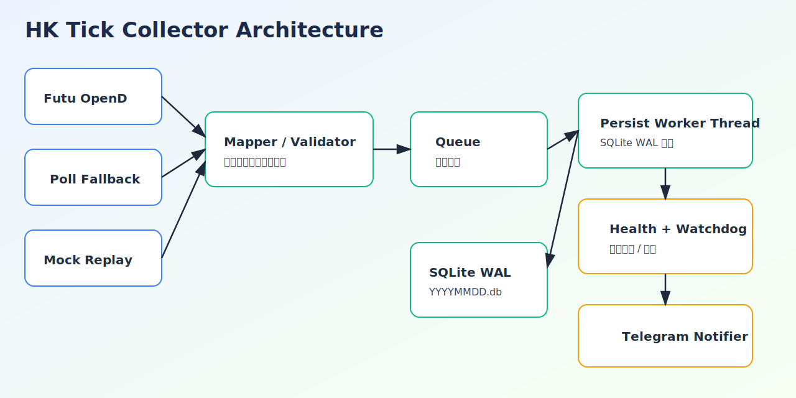
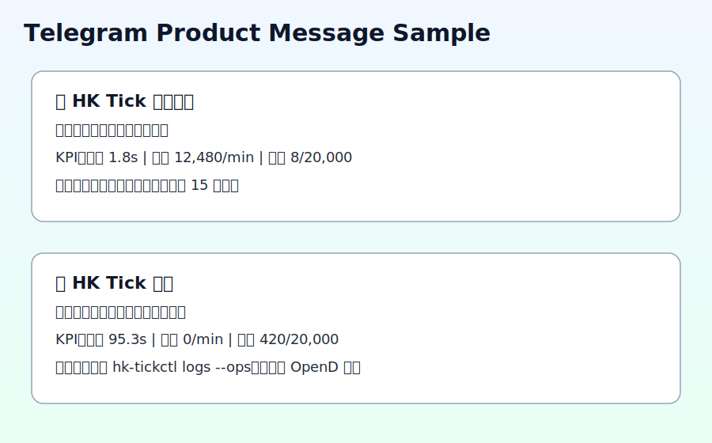
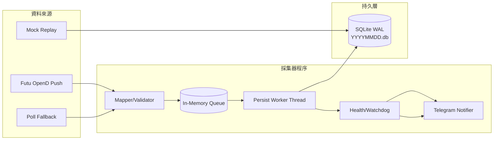

# HK Tick Collector

[](https://github.com/billpwchan/futu_tick_downloader/actions/workflows/ci.yml)
[](https://github.com/billpwchan/futu_tick_downloader/releases)
[](LICENSE)

一個面向生產環境的港股逐筆採集器：從 Futu OpenD 接收行情，經佇列（queue）與批次持久化（persist）安全寫入 SQLite（WAL），並提供 systemd 維運與 Telegram 產品化告警，讓陌生人可以從 0 到可驗證地跑起來。



## 使用場景

- 量化研究：逐筆落庫、回放查核、策略前資料完整性驗證。
- SRE/運維：watchdog 自癒、低噪音告警、值班 runbook。
- 個人玩家：在 AWS Lightsail 低成本長期運行。

## 30 秒快速開始

### 路徑 A：本機 Docker（含可選 mock）

```bash
git clone https://github.com/billpwchan/futu_tick_downloader.git
cd futu_tick_downloader
cp .env.example .env
docker compose --profile mock up -d --build mock-replay
make db-stats
```

### 路徑 B：伺服器 systemd（Ubuntu/Lightsail）

```bash
git clone https://github.com/billpwchan/futu_tick_downloader.git
cd futu_tick_downloader
cp deploy/env/.env.example /etc/hk-tick-collector.env
sudo bash deploy/scripts/install.sh
sudo systemctl status hk-tick-collector --no-pager
```

## Demo：三件事就知道有跑起來

### 1) 看今日資料是否活著（status）

```bash
scripts/hk-tickctl status --data-root /data/sqlite/HK --day $(TZ=Asia/Hong_Kong date +%Y%m%d)
```

### 2) 做可用性驗收（validate）

```bash
scripts/hk-tickctl validate --data-root /data/sqlite/HK \
  --day $(TZ=Asia/Hong_Kong date +%Y%m%d) \
  --regen-report 1 \
  --strict 1
```

### 3) 盤後歸檔（archive）

```bash
scripts/hk-tickctl archive --data-root /data/sqlite/HK \
  --day $(TZ=Asia/Hong_Kong date +%Y%m%d) \
  --archive-dir /data/sqlite/HK/_archive \
  --keep-days 14 \
  --delete-original 1 \
  --verify 1
```



## Telegram 產品化通知

- 訊息結構：`結論 -> 關鍵指標 -> 下一步`
- 每則訊息提供互動按鈕：`🔎 詳情` / `🧾 日誌` / `🗃 DB` / `🧯 建議`
- 互動模式可選啟用：`TG_INTERACTIVE_ENABLED=1`

示例 1（盤中 HEALTH）：

```text
🟢 HEALTH OK
結論：盤中採集與落庫穩定
關鍵指標：市況=盤中 | 落庫=12600/min | 延遲=1.8s | 今日rows=2,300,000 | 佇列=8/1000
下一步：按 🔎 看詳情；排查時先按 🧾 或 🗃
```

示例 2（PERSIST_STALL ALERT）：

```text
🔴 ALERT
結論：持久化停滯，資料可能未落庫
關鍵指標：事件=PERSIST_STALL | 市況=盤中 | 重點=lag_sec=88.2 | persisted_per_min=0
影響：資料可能持續落後
下一步：先按 🧾 看是否持續，再按 🧯 執行 SOP
```

示例 3（收盤 DAILY DIGEST）：

```text
📊 DAILY DIGEST
結論：20260214 收盤摘要
關鍵指標：總量=1,000,000 | 峰值=38,000/min | 最大延遲=3.2s | 告警/恢復=4/3
資料檔：/data/sqlite/HK/20260214.db | rows=2,300,000
下一步：按 📈 今日 Top 異常
```

## 架構圖（資料流、模組邊界、線程/佇列）



## 常用命令（最少必要）

```bash
make setup
make lint
make test
make run
make logs
make db-stats
scripts/hk-tickctl status --data-root /data/sqlite/HK
scripts/hk-tickctl validate --data-root /data/sqlite/HK --day 20260213 --regen-report 1
scripts/hk-tickctl export --data-root /data/sqlite/HK db --day 20260213 --out /tmp/20260213.backup.db
scripts/hk-tickctl archive --data-root /data/sqlite/HK --day 20260213 --verify 1
```

其餘操作請看：[`docs/04-運維 Runbook.md`](docs/04-%E9%81%8B%E7%B6%AD%20Runbook.md)

## FAQ（常見坑）

1. 時區怎麼看？
   `ts_ms`/`recv_ts_ms` 都是 UTC epoch 毫秒；交易日切分用 `Asia/Hong_Kong`。
2. 為什麼堅持 WAL？
   WAL 讓讀寫並行更穩定，降低寫入尖峰時讀取阻塞。
3. `busy_timeout` 要設多少？
   建議先用 `5000ms`，高併發下可視磁碟 I/O 調到 `7000-10000ms`。
4. OpenD 常斷線怎麼辦？
   先看 `hk-tickctl status` 與 `logs --ops`，確認 reconnect 與 watchdog 是否正常觸發。
5. 盤前/盤後零流量算異常嗎？
   不一定。通知策略會依 market mode（開盤前/盤中/午休/收盤後）降噪。
6. 非交易日為什麼會看到 `YYYYMMDD.db`？
   新版行為改為「首筆 tick 才建庫」，非交易日不會因服務啟動自動建立空 DB。
7. 收盤後有 `.db-wal` 是不是還在持續寫入？
   不一定。WAL 檔在程序存活期間存在屬正常；請以 `db rows`、`persisted_rows_per_min`、`queue` 判斷是否仍有實際寫入。

## 文件入口

- 文件總入口：[`docs/_index.md`](docs/_index.md)
- CLI 手冊：[`docs/hk-tickctl.md`](docs/hk-tickctl.md)
- 品質報告：[`docs/quality.md`](docs/quality.md)
- 歸檔策略：[`docs/archive.md`](docs/archive.md)
- 快速開始（本機）：[`docs/01-快速開始（本機）.md`](docs/01-%E5%BF%AB%E9%80%9F%E9%96%8B%E5%A7%8B%EF%BC%88%E6%9C%AC%E6%A9%9F%EF%BC%89.md)
- Lightsail 部署：[`docs/02-部署到 AWS Lightsail（Ubuntu）.md`](docs/02-%E9%83%A8%E7%BD%B2%E5%88%B0%20AWS%20Lightsail%EF%BC%88Ubuntu%EF%BC%89.md)
- Runbook：[`docs/04-運維 Runbook.md`](docs/04-%E9%81%8B%E7%B6%AD%20Runbook.md)
- Telegram 互動通知：[`docs/telegram.md`](docs/telegram.md)

## Roadmap

- `v0.1`: 穩定採集 + WAL + Telegram 產品化通知 + 基礎 runbook。
- `v0.2`: 壓縮存儲、日終歸檔、自動匯出校驗包。
- `v1.0`: topic 細分路由、symbol 規模擴展、可選多儲存後端。

## 社群與治理

- 貢獻指南：[`CONTRIBUTING.md`](CONTRIBUTING.md)
- 行為準則：[`CODE_OF_CONDUCT.md`](CODE_OF_CONDUCT.md)
- 安全政策：[`SECURITY.md`](SECURITY.md)
- 支援方式：[`SUPPORT.md`](SUPPORT.md)
- 授權：Apache-2.0（[`LICENSE`](LICENSE)）
