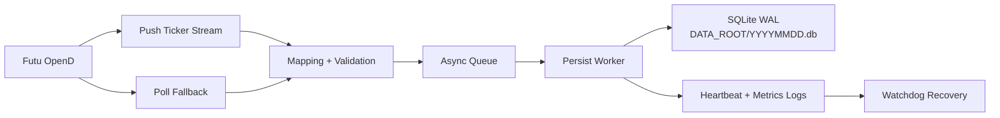

# hk-tick-collector

[](https://github.com/billpwchan/futu_tick_downloader/actions/workflows/ci.yml)
[](https://github.com/billpwchan/futu_tick_downloader/releases)
[](https://www.python.org/)
[](LICENSE)

High-reliability HK tick collector for Futu OpenD with SQLite WAL persistence.
It is designed for long-running `systemd` production services and idempotent tick ingestion.

[中文文档 (README.zh-CN)](README.zh-CN.md)

## Features

- Push-first ingestion with poll fallback from Futu OpenD.
- SQLite per-trading-day files in WAL mode.
- Durable dedupe with unique indexes + `INSERT OR IGNORE`.
- Watchdog self-healing for persistent writer stalls.
- Env-driven config (`.env` / `EnvironmentFile`) with sane defaults.
- Linux `systemd`-ready deployment templates and scripts.

## Architecture



Details: [`docs/architecture.md`](docs/architecture.md)

## Quickstart (Local, No Live OpenD Required)

This path verifies installation and core pipeline behavior without a running Futu OpenD.

```bash
git clone <YOUR_FORK_OR_REPO_URL>
cd futu_tick_downloader
python3 -m venv .venv
. .venv/bin/activate
pip install -U pip
pip install -e .[dev]
pytest -q
```

### Optional: run one smoke test only

```bash
pytest -q tests/test_smoke_pipeline.py
```

## Quickstart (Production with Futu OpenD)

1. Prepare env file:

```bash
cp .env.example .env
```

2. Configure at least:

```dotenv
FUTU_HOST=127.0.0.1
FUTU_PORT=11111
FUTU_SYMBOLS=HK.00700,HK.00981
DATA_ROOT=/data/sqlite/HK
```

3. Run directly (for validation):

```bash
. .venv/bin/activate
hk-tick-collector
# backward-compatible entrypoint still works:
python -m hk_tick_collector.main
```

4. Verify DB freshness:

```bash
DAY=$(TZ=Asia/Hong_Kong date +%Y%m%d)
DB=/data/sqlite/HK/${DAY}.db
bash scripts/db_health_check.sh "$DB"
```

## Run In Production (systemd)

Primary deployment target is Linux + `systemd`.

- Unit template: [`deploy/systemd/hk-tick-collector.service`](deploy/systemd/hk-tick-collector.service)
- Deployment guide: [`docs/deployment/systemd.md`](docs/deployment/systemd.md)
- Runbook: [`docs/runbook/operations.md`](docs/runbook/operations.md)

Common operations:

```bash
sudo systemctl daemon-reload
sudo systemctl enable --now hk-tick-collector
sudo systemctl status hk-tick-collector --no-pager
sudo journalctl -u hk-tick-collector -f
```

## Data Model

Main table (per daily DB):

```sql
CREATE TABLE ticks (
  market TEXT NOT NULL,
  symbol TEXT NOT NULL,
  ts_ms INTEGER NOT NULL,
  price REAL,
  volume INTEGER,
  turnover REAL,
  direction TEXT,
  seq INTEGER,
  tick_type TEXT,
  push_type TEXT,
  provider TEXT,
  trading_day TEXT NOT NULL,
  recv_ts_ms INTEGER NOT NULL,
  inserted_at_ms INTEGER NOT NULL
);
```

Indexes and dedupe key behavior:

- `uniq_ticks_symbol_seq`: dedupe for rows where `seq IS NOT NULL`.
- `uniq_ticks_symbol_ts_price_vol_turnover`: fallback dedupe when `seq IS NULL`.
- Persist SQL is `INSERT OR IGNORE`, so duplicates are idempotent by design.

SQLite settings (configurable by env):

- `journal_mode=WAL`
- `synchronous=NORMAL`
- `busy_timeout=5000` (default)
- `wal_autocheckpoint=1000` pages

## Timestamp Semantics (Important)

- `ticks.ts_ms`: event timestamp in **UTC epoch milliseconds**.
- `ticks.recv_ts_ms`: collector receive time in **UTC epoch milliseconds**.
- Futu local HK time strings are interpreted as `Asia/Hong_Kong`, then converted to UTC epoch ms.

This is intentional and should be preserved in downstream analytics.

## Common Queries

Use current trading day DB:

```bash
DAY=$(TZ=Asia/Hong_Kong date +%Y%m%d)
DB=/data/sqlite/HK/${DAY}.db
```

Freshness / lag:

```sql
SELECT
  datetime(strftime('%s','now'),'unixepoch') AS now_utc,
  datetime(MAX(ts_ms)/1000,'unixepoch') AS max_tick_utc,
  ROUND(strftime('%s','now') - MAX(ts_ms)/1000.0, 3) AS lag_sec,
  COUNT(*) AS rows
FROM ticks;
```

Rows by symbol:

```sql
SELECT symbol, COUNT(*) AS rows, MAX(seq) AS max_seq
FROM ticks
GROUP BY symbol
ORDER BY rows DESC;
```

Last tick per symbol:

```sql
SELECT t.symbol, t.seq, t.ts_ms, t.price, t.volume
FROM ticks t
JOIN (
  SELECT symbol, MAX(ts_ms) AS max_ts_ms
  FROM ticks
  GROUP BY symbol
) m ON m.symbol = t.symbol AND m.max_ts_ms = t.ts_ms
ORDER BY t.symbol;
```

Duplicate groups check:

```sql
SELECT 'dup_symbol_seq' AS check_name, COUNT(*) AS groups
FROM (
  SELECT symbol, seq FROM ticks WHERE seq IS NOT NULL GROUP BY symbol, seq HAVING COUNT(*) > 1
)
UNION ALL
SELECT 'dup_composite_when_seq_null' AS check_name, COUNT(*) AS groups
FROM (
  SELECT symbol, ts_ms, price, volume, turnover
  FROM ticks
  WHERE seq IS NULL
  GROUP BY symbol, ts_ms, price, volume, turnover
  HAVING COUNT(*) > 1
);
```

Clock drift check:

```sql
SELECT
  ROUND((MAX(recv_ts_ms) - MAX(ts_ms)) / 1000.0, 3) AS recv_minus_event_sec,
  ROUND((strftime('%s','now') * 1000 - MAX(ts_ms)) / 1000.0, 3) AS now_minus_event_sec
FROM ticks;
```

More SQL snippets: [`scripts/query_examples.sql`](scripts/query_examples.sql)

## Troubleshooting

- `WATCHDOG persistent_stall`: see [`docs/runbook/incident-watchdog-stall.md`](docs/runbook/incident-watchdog-stall.md)
- `database is locked` / `busy`: see [`docs/runbook/sqlite-wal.md`](docs/runbook/sqlite-wal.md)
- WAL file growth: tune checkpoint and runbook guidance in [`docs/runbook/sqlite-wal.md`](docs/runbook/sqlite-wal.md)
- Clock/timezone confusion: see [`docs/runbook/data-quality.md`](docs/runbook/data-quality.md)
- OpenD connectivity failures: see [`docs/troubleshooting.md`](docs/troubleshooting.md)

## Why SQLite WAL?

SQLite WAL is a strong default when you need:

- Simple operational footprint (single file per day).
- Fast local writes with concurrent readers.
- Easy snapshot backup and artifact transfer.

Prefer Postgres/Parquet when you need:

- Multi-writer ingestion across hosts.
- Large historical analytics beyond single-node SQLite ergonomics.
- Columnar scan performance at scale (Parquet + OLAP tooling).

## Demo

- Sample log excerpt and query output: [`docs/getting-started.md`](docs/getting-started.md)
- Asset placeholders/screenshots: [`docs/assets/README.md`](docs/assets/README.md)

## Contributing

- Contribution guide: [`CONTRIBUTING.md`](CONTRIBUTING.md)
- Security policy: [`SECURITY.md`](SECURITY.md)
- Support channels: [`SUPPORT.md`](SUPPORT.md)

## Security, License, Disclaimer

- License: Apache-2.0 (`LICENSE`)
- Futu OpenD access and market data usage must comply with Futu terms and local regulations.
- This project is a collector/persistence service; it does not grant redistribution rights for proprietary market data.
