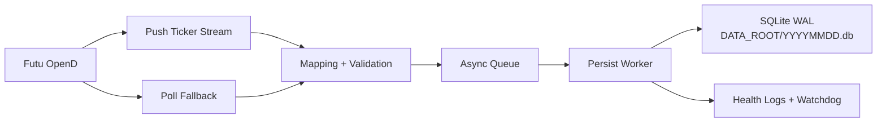

# hk-tick-collector

[](https://github.com/billpwchan/futu_tick_downloader/actions/workflows/ci.yml)
[](https://github.com/billpwchan/futu_tick_downloader/releases)
[](https://www.python.org/)
[](LICENSE)

Production-grade HK tick collector for Futu OpenD.

It ingests push + poll fallback ticks, deduplicates safely, and persists to SQLite WAL with systemd-friendly operations.

- For operators: fast deploy, clear runbooks, one-page incident commands.
- For developers: clean env config, tests, lint, packaging, CI.

[中文文档 (README.zh-CN)](README.zh-CN.md)

## Table Of Contents

- [Why This Project](#why-this-project)
- [Feature Highlights](#feature-highlights)
- [Architecture](#architecture)
- [3-Minute Quickstart](#3-minute-quickstart)
- [Production Deployment (systemd)](#production-deployment-systemd)
- [Data Model And Guarantees](#data-model-and-guarantees)
- [Operations Cheat Sheet](#operations-cheat-sheet)
- [Troubleshooting](#troubleshooting)
- [Documentation Map](#documentation-map)
- [Roadmap](#roadmap)
- [Contributing](#contributing)
- [Security License Disclaimer](#security-license-disclaimer)

## Why This Project

Most market-data collectors fail in production for one of these reasons: unclear timestamp semantics, weak dedupe, poor incident tooling, or fragile restarts.

`hk-tick-collector` focuses on operational correctness first:

- Explicit UTC timestamp semantics for storage.
- Idempotent writes via unique indexes + `INSERT OR IGNORE`.
- Watchdog recovery for persist stalls.
- Linux systemd deployment and runbooks included.

## Feature Highlights

- Push-first ingestion with poll fallback (`FUTU_POLL_*`).
- Per-trading-day SQLite files (`DATA_ROOT/YYYYMMDD.db`).
- WAL mode, configurable busy timeout, auto-checkpoint.
- Durable dedupe for `seq` and non-`seq` rows.
- Health heartbeat logs with queue, commit, drift, and watchdog context.
- Production docs: deployment, operations, incident response, data quality.

## Architecture



Detailed design: [`docs/architecture.md`](docs/architecture.md)

## 3-Minute Quickstart

### Option A: Validate locally (no live OpenD required)

```bash
git clone <YOUR_FORK_OR_REPO_URL>
cd futu_tick_downloader
python3 -m venv .venv
. .venv/bin/activate
pip install -U pip
pip install -e .[dev]
pytest -q
```

### Option B: Live run with OpenD

```bash
cp .env.example .env
# set FUTU_HOST/FUTU_PORT/FUTU_SYMBOLS/DATA_ROOT

. .venv/bin/activate
hk-tick-collector
# existing production entrypoint also works:
python -m hk_tick_collector.main
```

Verify writes:

```bash
DAY=$(TZ=Asia/Hong_Kong date +%Y%m%d)
DB=/data/sqlite/HK/${DAY}.db
bash scripts/db_health_check.sh "$DB"
```

## Production Deployment (systemd)

- Unit template: [`deploy/systemd/hk-tick-collector.service`](deploy/systemd/hk-tick-collector.service)
- Deployment guide: [`docs/deployment/systemd.md`](docs/deployment/systemd.md)
- One-page production runbook (CN): [`docs/runbook/production-onepager.md`](docs/runbook/production-onepager.md)

Enable service:

```bash
sudo systemctl daemon-reload
sudo systemctl enable --now hk-tick-collector
sudo systemctl status hk-tick-collector --no-pager
```

## Data Model And Guarantees

Core table (`ticks`) is append-only from collector perspective.

```sql
CREATE TABLE ticks (
  market TEXT NOT NULL,
  symbol TEXT NOT NULL,
  ts_ms INTEGER NOT NULL,
  price REAL,
  volume INTEGER,
  turnover REAL,
  direction TEXT,
  seq INTEGER,
  tick_type TEXT,
  push_type TEXT,
  provider TEXT,
  trading_day TEXT NOT NULL,
  recv_ts_ms INTEGER NOT NULL,
  inserted_at_ms INTEGER NOT NULL
);
```

### Dedupe guarantees

- `uniq_ticks_symbol_seq` when `seq IS NOT NULL`.
- `uniq_ticks_symbol_ts_price_vol_turnover` when `seq IS NULL`.
- `INSERT OR IGNORE` makes ingestion idempotent under retries and push/poll overlap.

### Timestamp guarantees

- `ts_ms`: event timestamp in UTC epoch milliseconds.
- `recv_ts_ms`: collector receive timestamp in UTC epoch milliseconds.
- HK local source times are interpreted as `Asia/Hong_Kong`, then converted to UTC epoch.

## Operations Cheat Sheet

Service:

```bash
sudo systemctl restart hk-tick-collector
sudo systemctl status hk-tick-collector --no-pager
```

Logs:

```bash
sudo journalctl -u hk-tick-collector -f --no-pager
sudo journalctl -u hk-tick-collector --since "10 minutes ago" --no-pager \
  | grep -E "health|persist_ticks|persist_loop_heartbeat|WATCHDOG|sqlite_busy|ERROR"
```

Freshness:

```bash
DAY=$(TZ=Asia/Hong_Kong date +%Y%m%d)
DB=/data/sqlite/HK/${DAY}.db
sqlite3 "file:${DB}?mode=ro" \
  "SELECT ROUND(strftime('%s','now')-MAX(ts_ms)/1000.0,3) AS lag_sec, COUNT(*) AS rows FROM ticks;"
```

More SQL snippets: [`scripts/query_examples.sql`](scripts/query_examples.sql)

## Troubleshooting

- WATCHDOG stall: [`docs/runbook/incident-watchdog-stall.md`](docs/runbook/incident-watchdog-stall.md)
- SQLite WAL / locked: [`docs/runbook/sqlite-wal.md`](docs/runbook/sqlite-wal.md)
- Timestamp and drift checks: [`docs/runbook/data-quality.md`](docs/runbook/data-quality.md)
- General troubleshooting: [`docs/troubleshooting.md`](docs/troubleshooting.md)

## Documentation Map

- Quickstart: [`docs/getting-started.md`](docs/getting-started.md)
- Configuration (full env reference): [`docs/configuration.md`](docs/configuration.md)
- Architecture: [`docs/architecture.md`](docs/architecture.md)
- Deployment (systemd): [`docs/deployment/systemd.md`](docs/deployment/systemd.md)
- Operations runbook: [`docs/runbook/operations.md`](docs/runbook/operations.md)
- One-page runbook (CN): [`docs/runbook/production-onepager.md`](docs/runbook/production-onepager.md)
- Release process: [`docs/releasing.md`](docs/releasing.md)
- FAQ: [`docs/faq.md`](docs/faq.md)

## Roadmap

- Optional metrics endpoint for external observability stacks.
- Optional Parquet export flow for analytics pipelines.
- Additional integration tests for larger symbol universes.

## Contributing

- Guide: [`CONTRIBUTING.md`](CONTRIBUTING.md)
- Code of conduct: [`CODE_OF_CONDUCT.md`](CODE_OF_CONDUCT.md)
- PR template: [`.github/PULL_REQUEST_TEMPLATE.md`](.github/PULL_REQUEST_TEMPLATE.md)

## Security License Disclaimer

- Security policy: [`SECURITY.md`](SECURITY.md)
- Support channels: [`SUPPORT.md`](SUPPORT.md)
- License: Apache-2.0 ([`LICENSE`](LICENSE))

Futu OpenD and market data usage must comply with Futu terms and local regulations. This repository is a collector/persistence service and does not grant redistribution rights for proprietary data.
