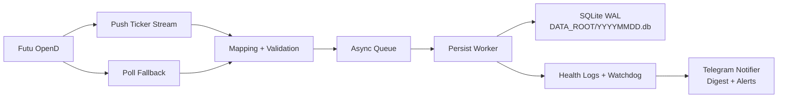

# hk-tick-collector

[](https://github.com/billpwchan/futu_tick_downloader/actions/workflows/ci.yml)
[](https://github.com/billpwchan/futu_tick_downloader/releases)
[](https://www.python.org/)
[](LICENSE)

面向生產環境的港股 Tick 採集服務，專為 Futu OpenD 設計。

本專案使用 Push 為主、Poll 為備援的資料匯入策略，提供安全去重，並將資料落盤至 SQLite WAL，同時具備適合 `systemd` 長時間運行的維運能力。

- 給維運人員：快速部署、清楚操作手冊、一頁式事件指令。
- 給開發人員：乾淨的環境設定、測試、lint、封裝與 CI 流程。

## 目錄

- [為什麼要做這個專案](#why-this-project)
- [功能亮點](#feature-highlights)
- [架構](#architecture)
- [3 分鐘快速開始](#3-minute-quickstart)
- [生產部署（systemd）](#production-deployment-systemd)
- [Telegram 通知](#telegram-notifications)
- [資料模型與保證](#data-model-and-guarantees)
- [維運速查](#operations-cheat-sheet)
- [故障排除](#troubleshooting)
- [文件導覽](#documentation-map)
- [路線圖](#roadmap)
- [如何貢獻](#contributing)
- [安全、授權與免責聲明](#security-license-disclaimer)

<a id="why-this-project"></a>
## 為什麼要做這個專案

多數市場資料採集器在生產環境失效，常見原因包含：時間戳語義不清、去重策略脆弱、事件處置工具不足，或重啟流程不穩定。

`hk-tick-collector` 先解決維運正確性：

- 以明確 UTC 語義定義落盤時間戳。
- 透過唯一索引 + `INSERT OR IGNORE` 提供冪等寫入。
- 具備 Watchdog 偵測與停滯恢復機制。
- 內建 Linux `systemd` 部署與操作手冊。

<a id="feature-highlights"></a>
## 功能亮點

- Push 優先的資料匯入，並提供 Poll 備援（`FUTU_POLL_*`）。
- 以交易日切分 SQLite 檔案（`DATA_ROOT/YYYYMMDD.db`）。
- WAL 模式、可調 `busy_timeout`、自動 checkpoint。
- 對 `seq` 與無 `seq` 資料都提供可持續去重。
- 心跳日誌包含佇列、commit、drift、Watchdog 等關鍵訊號。
- 低噪音 Telegram 群組通知（摘要 + 重要告警，含 rate limit 與 cooldown）。
- 提供完整生產文件：部署、維運、事件處置、資料品質檢查。

<a id="architecture"></a>
## 架構



完整設計請見：[`docs/architecture.md`](docs/architecture.md)

<a id="3-minute-quickstart"></a>
## 3 分鐘快速開始

### 選項 A：本機驗證（不需要即時 OpenD）

```bash
git clone <YOUR_FORK_OR_REPO_URL>
cd futu_tick_downloader
python3 -m venv .venv
. .venv/bin/activate
pip install -U pip
pip install -e .[dev]
pytest -q
```

### 選項 B：連接 OpenD 即時執行

```bash
cp .env.example .env
# set FUTU_HOST/FUTU_PORT/FUTU_SYMBOLS/DATA_ROOT

. .venv/bin/activate
hk-tick-collector
# existing production entrypoint also works:
python -m hk_tick_collector.main
```

驗證是否有成功寫入：

```bash
DAY=$(TZ=Asia/Hong_Kong date +%Y%m%d)
DB=/data/sqlite/HK/${DAY}.db
bash scripts/db_health_check.sh "$DB"
```

<a id="production-deployment-systemd"></a>
## 生產部署（systemd）

- Unit 範本：[`deploy/systemd/hk-tick-collector.service`](deploy/systemd/hk-tick-collector.service)
- 部署指南：[`docs/deployment/systemd.md`](docs/deployment/systemd.md)
- 一頁式生產操作手冊：[`docs/runbook/production-onepager.md`](docs/runbook/production-onepager.md)

啟用服務：

```bash
sudo systemctl daemon-reload
sudo systemctl enable --now hk-tick-collector
sudo systemctl status hk-tick-collector --no-pager
```

<a id="telegram-notifications"></a>
## Telegram 通知

請在環境設定檔啟用（本機 `.env` 或生產 `systemd` `EnvironmentFile=`）：

```dotenv
TG_ENABLED=1
TG_BOT_TOKEN=<secret>
TG_CHAT_ID=-1001234567890
TG_MESSAGE_THREAD_ID=
TG_PARSE_MODE=HTML
HEALTH_INTERVAL_SEC=600
HEALTH_TRADING_INTERVAL_SEC=600
HEALTH_OFFHOURS_INTERVAL_SEC=1800
ALERT_COOLDOWN_SEC=600
ALERT_ESCALATION_STEPS=0,600,1800
TG_RATE_LIMIT_PER_MIN=18
TG_INCLUDE_SYSTEM_METRICS=1
INSTANCE_ID=hk-prod-a1
```

設計目標：

- human-friendly：第一層 6-10 行可快速判讀是否需處理。
- 低噪音：狀態變化 + 固定節奏、fingerprint 去重、冷卻與升級提醒。
- 高可靠：非同步佇列 worker、Telegram `429 retry_after`、本地 sender rate limit。
- 安全降級：通知失敗不會阻塞匯入與落盤流程（可完全關閉）。

摘要樣例：

```text
✅ HK Tick Collector · HEALTH · OK
結論：正常，資料採集與寫入穩定
影響：目前不需人工介入
關鍵：freshness=1.0s persisted/min=24310 queue=0/50000
主機：ip-10-0-1-12 (hk-prod-a1) day=20260212 mode=open
symbols:
 - HK.00700 age=0.8s lag=0
 - HK.00981 age=1.0s lag=0
<blockquote expandable>tech: ... suggest: ...</blockquote>
```

告警樣例：

```text
🚨 HK Tick Collector · PERSIST_STALL · ALERT
結論：異常，疑似停止寫入
影響：新資料可能未落庫，延遲持續擴大
需要處理：是
關鍵：stall_sec=242.3/180 queue=8542/50000 persisted/min=0
主機：ip-10-0-1-12 (hk-prod-a1) day=20260212 mode=open
<blockquote expandable>tech: ... suggest: journalctl ... sqlite3 ...</blockquote>
```

設定細節請見：[`docs/telegram-notify.md`](docs/telegram-notify.md)

<a id="data-model-and-guarantees"></a>
## 資料模型與保證

核心資料表（`ticks`）在採集器視角為 append-only。

```sql
CREATE TABLE ticks (
  market TEXT NOT NULL,
  symbol TEXT NOT NULL,
  ts_ms INTEGER NOT NULL,
  price REAL,
  volume INTEGER,
  turnover REAL,
  direction TEXT,
  seq INTEGER,
  tick_type TEXT,
  push_type TEXT,
  provider TEXT,
  trading_day TEXT NOT NULL,
  recv_ts_ms INTEGER NOT NULL,
  inserted_at_ms INTEGER NOT NULL
);
```

### 去重保證

- `uniq_ticks_symbol_seq`：當 `seq IS NOT NULL`。
- `uniq_ticks_symbol_ts_price_vol_turnover`：當 `seq IS NULL`。
- `INSERT OR IGNORE` 讓重試與 push/poll 重疊場景保持冪等。

### 時間戳保證

- `ts_ms`：事件時間（UTC epoch 毫秒）。
- `recv_ts_ms`：採集器接收時間（UTC epoch 毫秒）。
- 港股本地時間來源先以 `Asia/Hong_Kong` 解讀，再轉為 UTC epoch。

<a id="operations-cheat-sheet"></a>
## 維運速查

服務管理：

```bash
sudo systemctl restart hk-tick-collector
sudo systemctl status hk-tick-collector --no-pager
```

查看日誌：

```bash
sudo journalctl -u hk-tick-collector -f --no-pager
sudo journalctl -u hk-tick-collector --since "10 minutes ago" --no-pager \
  | grep -E "health|persist_ticks|persist_loop_heartbeat|WATCHDOG|sqlite_busy|ERROR"
```

新鮮度檢查：

```bash
DAY=$(TZ=Asia/Hong_Kong date +%Y%m%d)
DB=/data/sqlite/HK/${DAY}.db
sqlite3 "file:${DB}?mode=ro" \
  "SELECT ROUND(strftime('%s','now')-MAX(ts_ms)/1000.0,3) AS lag_sec, COUNT(*) AS rows FROM ticks;"
```

更多 SQL 範例：[`scripts/query_examples.sql`](scripts/query_examples.sql)

<a id="troubleshooting"></a>
## 故障排除

- WATCHDOG 停滯：[`docs/runbook/incident-watchdog-stall.md`](docs/runbook/incident-watchdog-stall.md)
- SQLite WAL / locked：[`docs/runbook/sqlite-wal.md`](docs/runbook/sqlite-wal.md)
- 時間戳與 drift 檢查：[`docs/runbook/data-quality.md`](docs/runbook/data-quality.md)
- 一般故障排除：[`docs/troubleshooting.md`](docs/troubleshooting.md)

<a id="documentation-map"></a>
## 文件導覽

- 快速開始：[`docs/getting-started.md`](docs/getting-started.md)
- 設定參考（完整環境變數）：[`docs/configuration.md`](docs/configuration.md)
- 架構：[`docs/architecture.md`](docs/architecture.md)
- 部署（systemd）：[`docs/deployment/systemd.md`](docs/deployment/systemd.md)
- 部署速覽：[`docs/deployment.md`](docs/deployment.md)
- Telegram 設定：[`docs/telegram-notify.md`](docs/telegram-notify.md)
- 維運操作手冊：[`docs/runbook.md`](docs/runbook.md)
- 延伸維運操作手冊：[`docs/runbook/operations.md`](docs/runbook/operations.md)
- 一頁式 Runbook：[`docs/runbook/production-onepager.md`](docs/runbook/production-onepager.md)
- 發版流程：[`docs/releasing.md`](docs/releasing.md)
- FAQ：[`docs/faq.md`](docs/faq.md)
- 文件風格與術語規範：[`docs/STYLEGUIDE.zh-TW.md`](docs/STYLEGUIDE.zh-TW.md)
- 翻譯自檢說明：[`docs/translation_check.md`](docs/translation_check.md)

<a id="roadmap"></a>
## 路線圖

- 可選的 metrics endpoint，供外部可觀測平台使用。
- 可選的 Parquet 匯出流程，供分析管線使用。
- 補強更大 symbol 規模下的整合測試。

<a id="contributing"></a>
## 如何貢獻

- 指南：[`CONTRIBUTING.md`](CONTRIBUTING.md)
- 行為準則：[`CODE_OF_CONDUCT.md`](CODE_OF_CONDUCT.md)
- PR 範本：[`.github/PULL_REQUEST_TEMPLATE.md`](.github/PULL_REQUEST_TEMPLATE.md)

<a id="security-license-disclaimer"></a>
## 安全、授權與免責聲明

- 安全政策：[`SECURITY.md`](SECURITY.md)
- 支援管道：[`SUPPORT.md`](SUPPORT.md)
- 授權：Apache-2.0（[`LICENSE`](LICENSE)）

Futu OpenD 與市場資料使用必須符合 Futu 條款與在地法規。本 repo 提供採集與落盤能力，不授予任何專有資料再散布權利。
