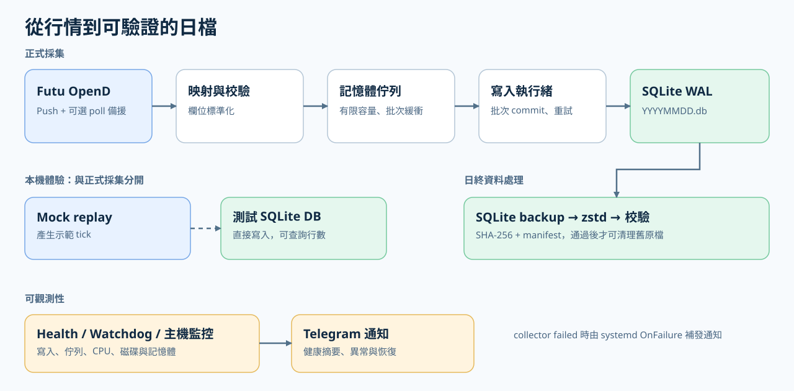
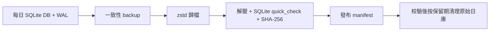
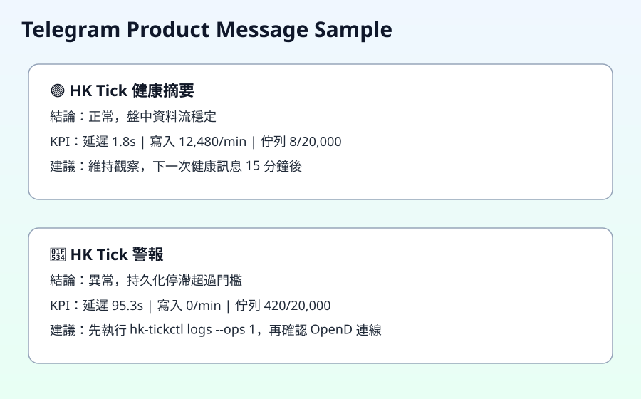

<a href="https://github.com/billpwchan"></a>

# HK Tick Collector

[](https://github.com/billpwchan/futu_tick_downloader/actions/workflows/ci.yml)
[](https://github.com/billpwchan/futu_tick_downloader/releases)
[](LICENSE)

從 Futu OpenD 接收港股逐筆行情，按香港交易日寫入 SQLite WAL。專案包含佇列與批次寫入、資料品質報告、經校驗的日終歸檔，以及 systemd 和 Telegram 維運工具。

> **先選路徑：**想看資料怎麼流動，從下方的 Docker mock 開始，不需要 Futu 帳戶；要接真實行情，請先完成 [OpenD 與行情權限部署](docs/02-%E9%83%A8%E7%BD%B2%E5%88%B0%20AWS%20Lightsail%EF%BC%88Ubuntu%EF%BC%89.md)。Mock 資料不能用於交易研究。

## 資料怎麼走



正式採集由 OpenD push 與可選 poll 備援進入映射器、記憶體佇列、寫入執行緒，再落入每日一個 SQLite DB。Mock 回放會**直接寫入測試 DB**，用來體驗查詢和檢查工具。主機監控與 watchdog 觀察執行狀態，Telegram 可發送健康摘要和異常通知。

## 5 分鐘本機體驗

前置需求：Docker 與 Docker Compose。下列指令從 repo 根目錄執行。容器以非 root 的 uid `10001` 執行；Linux 主機首次啟動前先執行 `mkdir -p data/sqlite && sudo chown -R 10001:10001 data/sqlite`。

```bash
git clone https://github.com/billpwchan/futu_tick_downloader.git
cd futu_tick_downloader
cp .env.example .env
docker compose --profile mock up -d --build mock-replay
docker compose --profile mock exec -T mock-replay \
  python -m hk_tick_collector.cli.main db stats --data-root /data/sqlite/HK
```

重跑最後一個命令，`rows` 應持續增加；也可用 `docker compose --profile mock logs --tail=20 mock-replay` 看寫入日誌。結束時執行 `docker compose --profile mock down`。本機 DB 存在 `./data/sqlite/`，停止容器不會刪除檔案。進階查詢見[本機快速開始](docs/01-%E5%BF%AB%E9%80%9F%E9%96%8B%E5%A7%8B%EF%BC%88%E6%9C%AC%E6%A9%9F%EF%BC%89.md)。

## 真實行情部署

Linux/systemd 安裝腳本以 `/opt/futu_tick_downloader` 為程式路徑，並需要 Python 3.10+、Futu OpenD 和有效的港股行情權限。腳本預設使用 `python3.11`；以下用 Ubuntu 已安裝的 `python3` 建立環境。請先依 [Lightsail 部署指南](docs/02-%E9%83%A8%E7%BD%B2%E5%88%B0%20AWS%20Lightsail%EF%BC%88Ubuntu%EF%BC%89.md)完成前置設定：

```bash
sudo git clone https://github.com/billpwchan/futu_tick_downloader.git /opt/futu_tick_downloader
cd /opt/futu_tick_downloader
sudo PYTHON_BIN=python3 bash deploy/scripts/install.sh
sudoedit /etc/hk-tick-collector.env
sudo systemctl restart hk-tick-collector
sudo systemctl status hk-tick-collector --no-pager
```

至少確認 `FUTU_HOST`、`FUTU_PORT`、`FUTU_SYMBOLS` 與資料目錄；Telegram 需另設 token、chat ID。安裝腳本會建立環境檔，但第一次啟動可能在填妥連線設定前失敗；填寫後重啟並檢查日誌。完整設定見[環境變數說明](docs/03-%E9%85%8D%E7%BD%AE%E8%AA%AA%E6%98%8E%EF%BC%88.env%EF%BC%89.md)。

## 驗證資料與歸檔

以下在已安裝專案 `.venv` 的主機執行。`DAY` 用香港時區計算；休市日或當日尚無 tick 時，沒有日檔屬正常情況。

```bash
cd /opt/futu_tick_downloader
DAY="$(TZ=Asia/Hong_Kong date +%Y%m%d)"
scripts/hk-tickctl status --data-root /data/sqlite/HK --day "$DAY"
scripts/hk-tickctl validate --data-root /data/sqlite/HK --day "$DAY" --regen-report 1 --strict 1
```

`status` 看檔案、行數與最近資料；`validate` 檢查 schema、覆蓋率及品質指標。盤後歸檔使用 SQLite 一致性備份，產生 zstd 檔、SHA-256 與 manifest；保留策略只清理通過校驗的舊日庫。


```mermaid
flowchart LR
  DB[每日 SQLite DB + WAL] --> Backup[一致性 backup]
  Backup --> Archive[zstd 歸檔]
  Archive --> Verify[解壓 + SQLite quick_check + SHA-256]
  Verify --> Manifest[發布 manifest]
  Manifest --> Retention[校驗後按保留期清理原始日庫]
```

手動預覽歸檔時可保留原始 DB：

```bash
scripts/hk-tickctl archive --data-root /data/sqlite/HK --day "$DAY" \
  --archive-dir /data/sqlite/HK/_archive --verify 1 --delete-original 0
```

自動歸檔的預設原始日庫保留量為最近 14 個交易日檔案，時間與上下游任務順序見[收盤後自動化](docs/09-%E6%94%B6%E7%9B%A4%E5%BE%8C%E8%87%AA%E5%8B%95%E5%8C%96%EF%BC%88%E6%AD%B8%E6%AA%94%E8%88%87%E6%9C%AC%E5%9C%B0%E6%8B%89%E5%8F%96%EF%BC%89.md)。歸檔格式和校驗規則見[歸檔說明](docs/archive.md)。

## 告警與維運



Telegram 訊息按「結論 → 關鍵指標 → 下一步」呈現，可選啟用互動按鈕。主機監控觀察 CPU、steal、磁碟及記憶體壓力；collector 進入 systemd failed 狀態時，獨立的 `OnFailure` unit 可通知值班群。設定與操作見 [Telegram 指南](docs/telegram.md)及[運維 Runbook](docs/04-%E9%81%8B%E7%B6%AD%20Runbook.md)。

## 資料語義與邊界

- `ts_ms`、`recv_ts_ms` 是 UTC epoch 毫秒；檔名 `YYYYMMDD.db` 按 `Asia/Hong_Kong` 交易日切分。
- WAL 允許讀寫並行；`.db-wal` 存在不代表仍有新成交。確認行數、寫入速率與佇列狀態。
- 首筆 tick 才建立日檔；不能把「沒有檔案」直接判定為故障。
- 採集佇列位於記憶體。程序停止或上游斷線期間可能缺資料，需配合品質報告與可用的歷史資料補回。

## 文件與開發

| 目的 | 入口 |
| --- | --- |
| CLI 查詢、匯出與歸檔 | [hk-tickctl 手冊](docs/hk-tickctl.md) |
| 資料格式與 SQL 查詢 | [資料格式](docs/06-%E8%B3%87%E6%96%99%E6%A0%BC%E5%BC%8F%E8%88%87%E6%9F%A5%E8%A9%A2.md) |
| 品質報告與缺口 | [品質說明](docs/quality.md) |
| 部署、排查與恢復 | [運維 Runbook](docs/04-%E9%81%8B%E7%B6%AD%20Runbook.md) |
| 所有文件 | [文件索引](docs/_index.md) |
| 貢獻與安全回報 | [貢獻指南](CONTRIBUTING.md) · [安全政策](SECURITY.md) |

開發環境執行 `make setup`，之後用 `make lint` 和 `make test` 檢查。專案以 Apache-2.0 授權，見 [LICENSE](LICENSE)。

## 同一套交易基礎設施

**futu_tick_downloader**（逐筆採集）→ **[strategy_powerbacktest](https://github.com/billpwchan/strategy_powerbacktest)**（回測）→ **[futu_algo](https://github.com/billpwchan/futu_algo)**（實盤交易）

由 [Bill Chan](https://github.com/billpwchan) 開發與維護。
