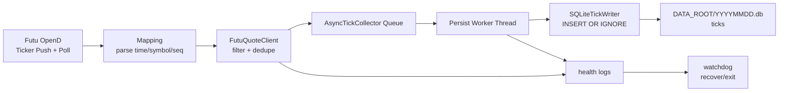

# 架構說明

## 目的

`hk-tick-collector` 從 Futu OpenD 匯入港股 tick 資料，按交易日落盤到 SQLite，並透過冪等寫入與維運護欄支援長時間 `systemd` 執行。

## 資料流

## 核心元件

- `hk_tick_collector/main.py`：啟動流程、signal 掛載、生命週期協調。
- `hk_tick_collector/futu_client.py`：OpenD 連線、push/poll、健康檢查與 Watchdog。
- `hk_tick_collector/collector.py`：非同步佇列 + 專用落盤 worker thread。
- `hk_tick_collector/db.py`：schema 建立／遷移、PRAGMA 設定、writer 抽象。
- `hk_tick_collector/mapping.py`：將上游資料列轉為內部 `TickRow`。

## 儲存與去重

- 每日 DB：`DATA_ROOT/YYYYMMDD.db`
- 資料表：`ticks`
- 唯一索引：
  - `uniq_ticks_symbol_seq`（`seq IS NOT NULL`）
  - `uniq_ticks_symbol_ts_price_vol_turnover`（`seq IS NULL`）
- 寫入模式：`INSERT OR IGNORE`

此設計可在重試與 push/poll 重疊期間維持冪等落盤。

## 時間戳語義

`ts_ms` 與 `recv_ts_ms` 採嚴格語義：

- `ts_ms`：事件時間，UTC epoch 毫秒。
- `recv_ts_ms`：採集器接收時間，UTC epoch 毫秒。
- 港股本地時間（無時區）一律先按 `Asia/Hong_Kong` 解讀，再轉 UTC epoch。

除修正正確性 bug 外，不應任意改變執行期行為。

## Watchdog 設計

Watchdog 由健康檢查迴圈觸發，依賴可持續訊號：

- 上游近期仍有活動，
- 佇列 backlog 超過 `WATCHDOG_QUEUE_THRESHOLD_ROWS`，
- commit 進度停滯（`commit_age >= WATCHDOG_STALL_SEC`）或 worker 已失效。

恢復路徑：

1. 輸出診斷與 thread dump。
2. 嘗試程序內 writer recovery。
3. 若連續失敗超過門檻，非零退出交由 `systemd` 重啟。

## 可靠性補充

- WAL 模式可在寫入時維持讀取併發。
- `busy_timeout` 與 backoff 降低暫時鎖衝突影響。
- 心跳日誌提供佇列／排空／commit 可觀測性。
- 優雅停止會在 `STOP_FLUSH_TIMEOUT_SEC` 內盡量排空佇列。
