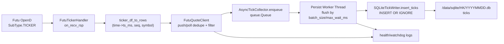

# Architecture: hk-tick-collector

## 1. 系统角色

- `futu-opend.service`: 提供 Futu OpenAPI 数据入口。
- `hk-tick-collector.service`: 本项目采集进程，负责接收、过滤、入队、落库。
- SQLite 日分库：`DATA_ROOT/YYYYMMDD.db`，核心表 `ticks`。

## 2. 数据流（push + poll + queue + persist）



## 3. 关键协程/线程

- 主协程：`main.run()`
  - 初始化配置、SQLite store、seed 最近交易日 `max(seq)`。
  - 启动 `AsyncTickCollector` 和 `FutuQuoteClient`。
- `FutuQuoteClient` 协程组：
  - `_monitor_connection()`：OpenD 连通性检查。
  - `_poll_loop()`：按 `FUTU_POLL_*` 做兜底轮询与去重。
  - `_health_loop()`：每分钟输出 health，并执行 watchdog。
- `AsyncTickCollector` 持久化线程：
  - 从队列取批次，按 `trading_day` 分组写库。
  - 支持 retry/backoff、busy/locked 恢复、writer 重建。

## 4. 去重与唯一键设计

`ticks` 表关键唯一索引：

- `uniq_ticks_symbol_seq`：`(symbol, seq)`，仅 `seq IS NOT NULL`。
- `uniq_ticks_symbol_ts_price_vol_turnover`：`(symbol, ts_ms, price, volume, turnover)`，仅 `seq IS NULL`。

写入 SQL 为 `INSERT OR IGNORE`，因此：

- `persist_ticks inserted=N ignored=M` 中的 `ignored` 大部分是重复数据被唯一索引拦截。
- `poll_stats dropped_duplicate` 是**入队前**的轮询去重；`ignored` 是**落库时**最终幂等保护。

这两个指标都高不一定是故障，常见于 push 与 poll 同时覆盖或上游重复发送。

## 5. 为什么会出现大量 dropped_duplicate

常见原因：

- push 正常，poll 仅用于兜底，拿到的 `seq` 已落库或已接收。
- 断线重连后，上游重复回放最近窗口。
- `seq` 为空时，同一 `(symbol, ts_ms, price, volume, turnover)` 多次到达。

判断是否健康看三件事：

- `queue` 没持续上涨；
- `persist_ticks` 持续出现；
- `MAX(ts_ms)` lag 在阈值内。

## 6. ts_ms 语义（重点）

- `ticks.ts_ms`：事件发生时间，UTC epoch 毫秒。
- `ticks.recv_ts_ms`：采集进程接收时间，UTC epoch 毫秒。
- 对于 HK 市场本地时间（无时区字符串），映射时按 `Asia/Hong_Kong` 解释，再转 UTC epoch。

验证时要注意：

- SQLite `datetime(ts_ms/1000,'unixepoch')` 默认按 UTC 展示。
- 若要本地展示，加 `,'localtime'`（取决于系统时区）或在应用层显式转 `Asia/Hong_Kong`。

## 7. Watchdog 判定与自愈

当前 watchdog（`futu_client._check_watchdog`）触发前提：

- 上游近期活跃（push/poll/queue 指标有推进）；
- 队列 backlog 达到 `WATCHDOG_QUEUE_THRESHOLD_ROWS`；
- 且出现 `worker_dead` 或 `commit_age >= WATCHDOG_STALL_SEC`。

触发动作：

1. 打印线程栈（diagnostic dump）；
2. 同进程重建 writer；
3. 连续恢复失败达到 `WATCHDOG_RECOVERY_MAX_FAILURES` 才 `SystemExit(1)` 交给 systemd 拉起。

## 8. 数据库结构（代码实况）

```sql
CREATE TABLE ticks (
  market TEXT NOT NULL,
  symbol TEXT NOT NULL,
  ts_ms INTEGER NOT NULL,
  price REAL,
  volume INTEGER,
  turnover REAL,
  direction TEXT,
  seq INTEGER,
  tick_type TEXT,
  push_type TEXT,
  provider TEXT,
  trading_day TEXT NOT NULL,
  recv_ts_ms INTEGER NOT NULL,
  inserted_at_ms INTEGER NOT NULL
);
```

## 9. 相关文档

- 配置项：[`docs/configuration.md`](configuration.md)
- 部署：[`docs/deployment/ubuntu-systemd.md`](deployment/ubuntu-systemd.md)
- 运维排障：[`docs/operations/runbook-hk-tick-collector.md`](operations/runbook-hk-tick-collector.md)
