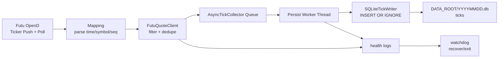

# Architecture

## Purpose

`hk-tick-collector` ingests HK tick data from Futu OpenD and persists it into SQLite per trading day, with idempotent writes and operational guardrails for long-running `systemd` services.

## Data Flow

## Core Components

- `hk_tick_collector/main.py`: app bootstrap, signal wiring, lifecycle orchestration.
- `hk_tick_collector/futu_client.py`: OpenD connection, push/poll, health and watchdog.
- `hk_tick_collector/collector.py`: async queue + dedicated persist worker thread.
- `hk_tick_collector/db.py`: schema creation/migration, PRAGMA setup, writer abstraction.
- `hk_tick_collector/mapping.py`: converts upstream rows to internal `TickRow`.

## Storage and Dedupe

- Daily DB: `DATA_ROOT/YYYYMMDD.db`
- Table: `ticks`
- Unique indexes:
  - `uniq_ticks_symbol_seq` where `seq IS NOT NULL`
  - `uniq_ticks_symbol_ts_price_vol_turnover` where `seq IS NULL`
- Insert mode: `INSERT OR IGNORE`

This yields idempotent persistence under retries and overlapping push/poll windows.

## Timestamp Semantics

`ts_ms` and `recv_ts_ms` semantics are intentionally strict:

- `ts_ms`: event time in UTC epoch milliseconds.
- `recv_ts_ms`: collector receive time in UTC epoch milliseconds.
- HK market local timestamps (without timezone) are interpreted as `Asia/Hong_Kong`, then converted to UTC epoch.

No runtime behavior should change unless fixing correctness bugs.

## Watchdog Design

Watchdog checks happen from health loop and rely on durable signals:

- upstream still active recently,
- queue backlog above `WATCHDOG_QUEUE_THRESHOLD_ROWS`,
- commit progress stalled (`commit_age >= WATCHDOG_STALL_SEC`) or worker dead.

Recovery path:

1. emit diagnostics/thread dump,
2. attempt writer recovery in-process,
3. if repeated failures exceed threshold, exit non-zero and let `systemd` restart.

## Reliability Notes

- WAL mode enables concurrent read while writing.
- `busy_timeout` and backoff protect against transient lock contention.
- Heartbeat logs provide queue/drain/commit visibility.
- Graceful stop drains queue within `STOP_FLUSH_TIMEOUT_SEC`.
